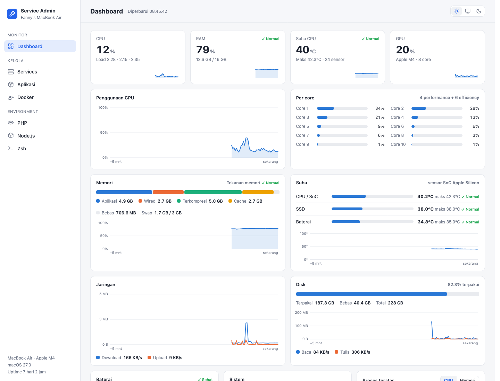
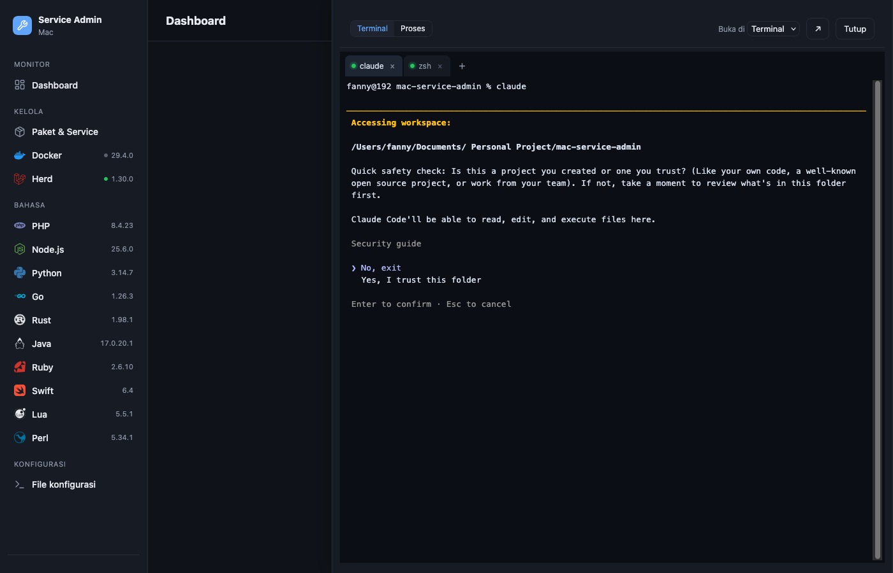
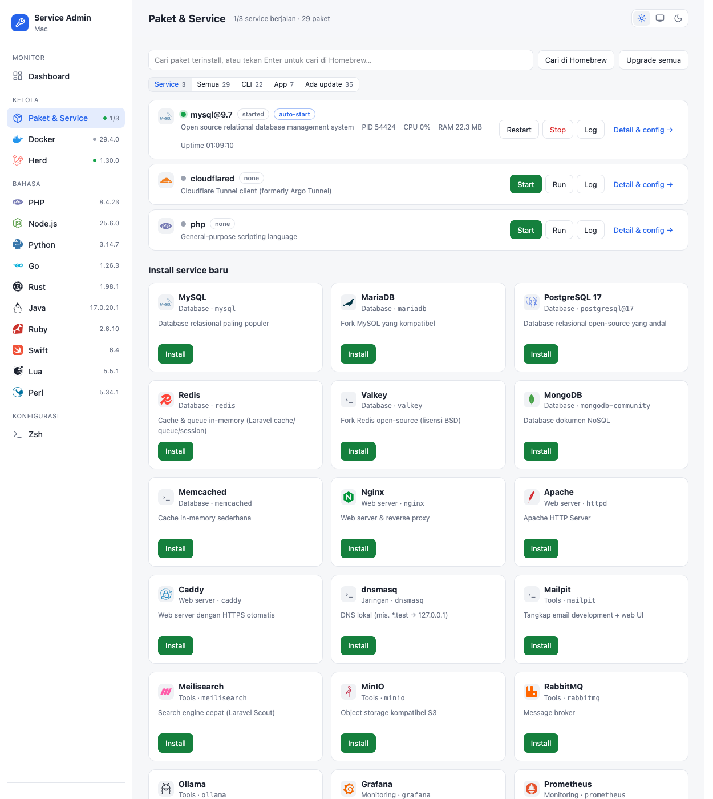
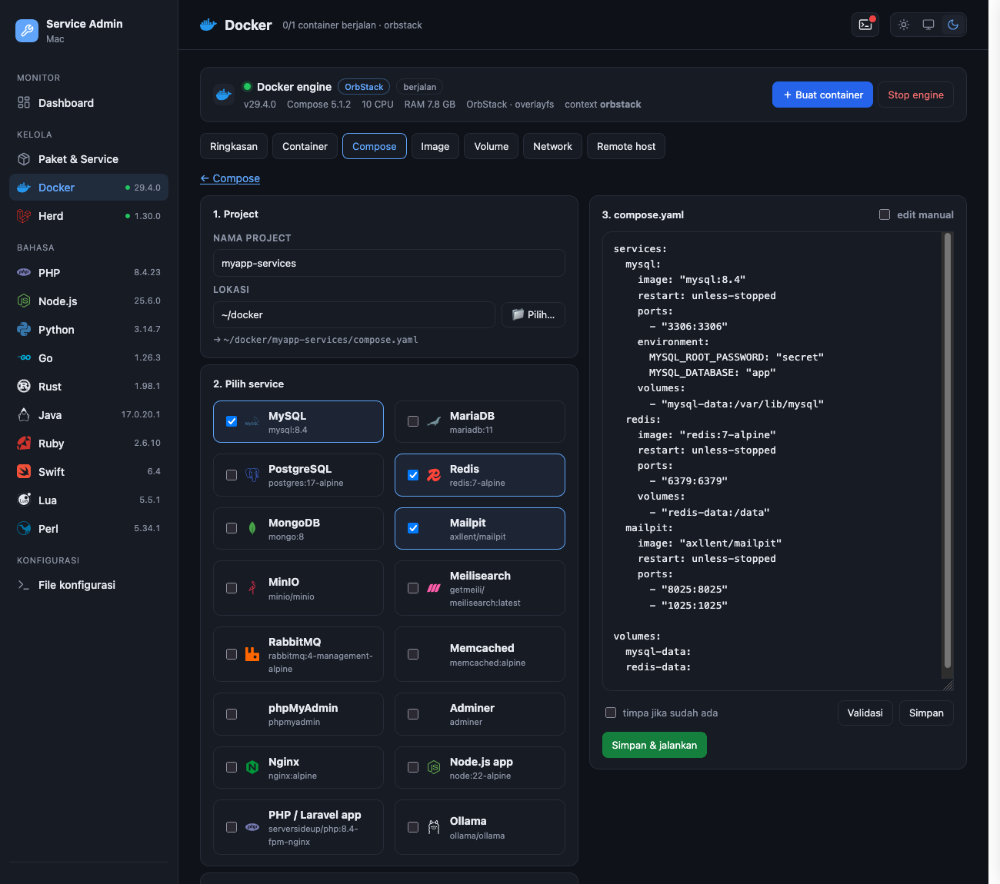
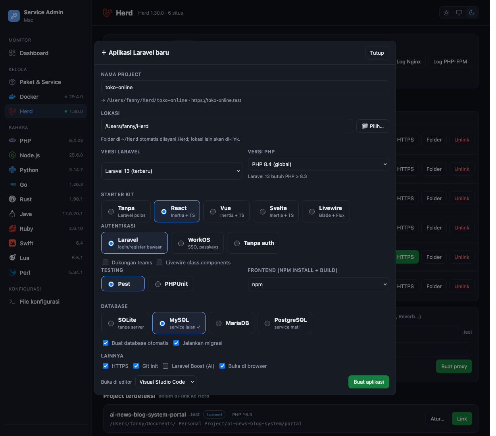
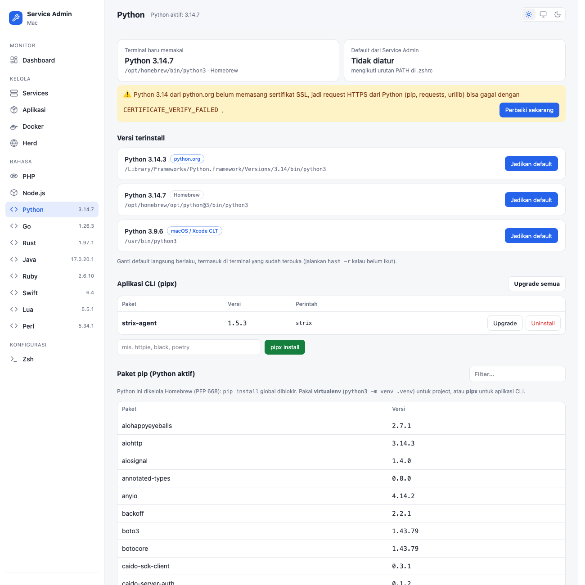
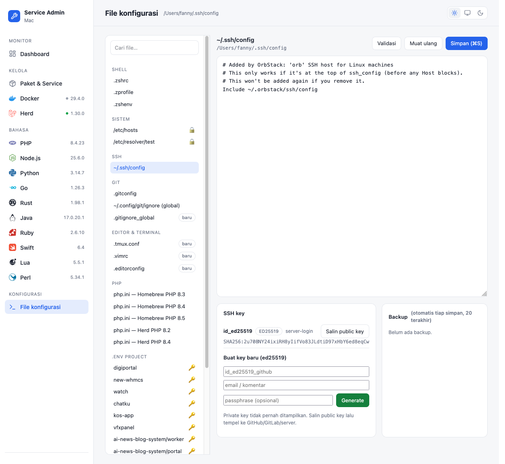

# Mac Service Admin

Dashboard web lokal untuk mengelola **dev environment macOS** dari satu tempat: Homebrew services & paket,
Docker, Laravel Herd, versi bahasa pemrograman, file konfigurasi, statistik sistem, dan **terminal
sungguhan di browser** (Claude Code, vim, htop jalan normal).

- **Tanpa dependensi.** Backend Python stdlib, frontend vanilla JS. Tidak ada `pip install` atau `npm install`.
- **Lokal & offline.** Hanya listen di `127.0.0.1`, dan semua aset (ikon, xterm.js) disimpan di repo.
- **Dibuat untuk Apple Silicon.** Suhu, GPU, dan baterai dibaca langsung tanpa `sudo`.



---

## Daftar isi

- [Fitur](#fitur)
- [Persyaratan](#persyaratan)
- [Menjalankan](#menjalankan)
- [Cara kerja](#cara-kerja)
- [Keamanan](#keamanan)
- [Struktur project](#struktur-project)
- [Troubleshooting](#troubleshooting)
- [Kredit](#kredit)

---

## Fitur

### 📊 Dashboard
- CPU total & **per core** (performance/efficiency), load average
- RAM (aplikasi, wired, terkompresi, cache), swap, **memory pressure**
- **Suhu** CPU/SoC, SSD, dan baterai lewat sensor Apple Silicon, tanpa sudo
- GPU, jaringan (download/upload), disk (kapasitas & baca/tulis)
- Baterai: persen, kesehatan, cycle count, daya sistem (W)
- Proses teratas (CPU/Memori) + tombol **Buka Activity Monitor**
- Riwayat 5 menit dengan grafik & tooltip

### 🖥️ Terminal & proses (ikon di header, `Ctrl+``)
- **Terminal sungguhan** (PTY + xterm.js): zsh dengan `.zshrc` kamu, banyak tab sesi, warna, resize.
  Program interaktif seperti `claude`, `vim`, `htop`, `php artisan tinker`, dan `ssh` jalan normal.
- Sesi tetap hidup saat halaman di-refresh.
- Tab **Proses**: semua proses background (install, compose up, `laravel new`, …) dengan output live dan tombol Stop.
- **Titik merah** di ikon selama ada proses yang berjalan.
- Tombol **↗** untuk membuka Terminal.app / iTerm / Warp.



### 📦 Paket & Service (Homebrew)
- Paket CLI, aplikasi (cask), dan `brew services` dalam satu halaman. Filter: Service · Semua · CLI · App · Ada update.
- Start / Run / Stop / Restart service, lihat log, CPU/RAM/uptime.
- **⭐ 100 rekomendasi paket development** per kategori, sekali klik install.
- Katalog service populer (MySQL, PostgreSQL, Redis, Nginx, Mailpit, Meilisearch, MinIO, Ollama, …).
- **Detail service**: port yang dipakai, folder data, log, catatan Homebrew, dan **editor config** dengan validasi
  (`mysqld --validate-config`, `nginx -t`, `php-fpm -t`, `caddy validate`, …), plus *Simpan & restart*.
- **Cloudflare Tunnel**: login, buat/hapus tunnel, route DNS, tambah aturan ingress, jalankan/stop tunnel manual.



### 🐳 Docker (OrbStack / Docker Desktop)
- **Ringkasan**: statistik live per container (CPU, RAM, jaringan, disk, PID), grafik, pemakaian disk & prune.
- **Container**: start/stop/pause/hapus, detail (port, mount, network, env tersamar), log live.
- **Console** di browser (`cd` diikuti) + tombol terminal interaktif (`docker exec -it`).
- **Buat container** (form `docker run`) dengan cek bentrok port.
- **Compose**: up / pull / build / down, log, edit file dengan validasi.
- **Pembuat compose** dari 16 template dengan pratinjau YAML live.
- Image (pull, hapus, prune), Volume, Network.
- **Remote host**: kelola Docker di server lain lewat SSH (`docker context`).



### 🐘 Laravel Herd
- Status Herd (Nginx, DNS, PHP-FPM), start/stop/restart, log.
- Situs: HTTPS on/off, versi PHP per situs, unlink, buka folder.
- **＋ Aplikasi Laravel baru**: lokasi (dialog Finder), nama, versi Laravel 13/12/11/10, PHP, starter kit
  React/Vue/Svelte/Livewire, auth (Laravel/WorkOS), Pest/PHPUnit, database dengan pembuatan DB & migrasi otomatis,
  npm/pnpm/bun, Git, HTTPS, buka di editor.
- Link folder (dialog Finder), **deteksi project** PHP/Laravel yang belum di-link, proxy ke port lokal, parked folder.



### 🧩 Bahasa pemrograman
Menu **Bahasa** di sidebar membuka satu halaman berisi kartu semua bahasa yang terdeteksi (logo, versi, sumber, lokasi), plus bahasa yang belum terinstall dengan tombol install. Klik kartu untuk mengelola bahasa itu.

| Bahasa | Yang bisa dikelola |
|---|---|
| **PHP** | Pilih default dari Homebrew atau Herd (`herd use`), install/update versi PHP Herd |
| **Node.js** | Versi nvm + Homebrew: jadikan default, install (daftar LTS), uninstall |
| **Python** | Pilih default (python.org / Homebrew / pyenv / uv / sistem), pipx, daftar paket, perbaikan sertifikat SSL python.org |
| **Go** | Environment, cache (+ bersihkan), `go install` tool, cek versi terbaru |
| **Rust** | `rustup update`, toolchain, target, komponen, crate `cargo install` |
| **Java** | Pilih JDK (`JAVA_HOME`), termasuk OpenJDK Homebrew yang belum terdaftar |
| **Ruby** | Pilih versi (sistem / Homebrew / rbenv / rvm), daftar gem |
| Lainnya | Swift, Lua, Perl, Deno, Bun, .NET, Dart, Kotlin, Zig, Elixir, …: info versi & lokasi |



### 📝 File konfigurasi
Editor dengan **validasi sebelum simpan** dan **backup otomatis** (20 versi):

- Shell: `.zshrc`, `.zprofile`, `.zshenv`, `.bashrc` (+ deteksi PATH mati & baris dobel)
- Sistem 🔒: `/etc/hosts`, `/etc/resolver/*`. Disimpan lewat dialog password admin macOS, lalu cache DNS di-flush otomatis.
- SSH: `~/.ssh/config` + daftar key (salin public key, generate key baru)
- Git: `.gitconfig`, global gitignore
- `php.ini` (Homebrew & Herd), `.tmux.conf`, `.vimrc`, `.editorconfig`, npm/composer/pip/cargo config
- **`.env` semua project** (terdeteksi otomatis)



### 🎨 Lainnya
Tema **terang / gelap / ikut sistem**, sidebar responsif (menu hamburger di layar kecil), dan logo asli tiap bahasa/tool.

---

## Persyaratan

- macOS (dites di macOS 27, Apple Silicon M4)
- Python 3.11+ (bawaan Xcode Command Line Tools, python.org, atau Homebrew)
- [Homebrew](https://brew.sh)
- Opsional: OrbStack / Docker Desktop, Laravel Herd, nvm, rustup, dan lain-lain. Fitur terkait otomatis muncul kalau terdeteksi.

## Menjalankan

```bash
git clone git@github.com:FannyDevz/mac-service-admin.git
cd mac-service-admin
python3 server.py              # buka http://127.0.0.1:8765
python3 server.py --port 9000  # port lain
```

### Auto-start saat login (opsional)

Jalankan dari folder project. Perintah ini membuat LaunchAgent yang menyalakan dashboard setiap kali login:

```bash
cat > ~/Library/LaunchAgents/local.service-admin.plist <<EOF
<?xml version="1.0" encoding="UTF-8"?>
<!DOCTYPE plist PUBLIC "-//Apple//DTD PLIST 1.0//EN" "http://www.apple.com/DTDs/PropertyList-1.0.dtd">
<plist version="1.0"><dict>
  <key>Label</key><string>local.service-admin</string>
  <key>ProgramArguments</key><array>
    <string>$(command -v python3)</string><string>$PWD/server.py</string>
  </array>
  <key>EnvironmentVariables</key><dict><key>PATH</key><string>/opt/homebrew/bin:/usr/local/bin:/usr/bin:/bin</string></dict>
  <key>RunAtLoad</key><true/>
  <key>KeepAlive</key><true/>
  <key>StandardErrorPath</key><string>$HOME/.service-admin/logs/server.log</string>
</dict></plist>
EOF
mkdir -p ~/.service-admin/logs
launchctl load ~/Library/LaunchAgents/local.service-admin.plist
```

Untuk menghentikan: `launchctl unload ~/Library/LaunchAgents/local.service-admin.plist`

---

## Cara kerja

### Pilih versi default (PHP, Python, Go, Ruby, Java)
Service Admin membuat **symlink** di `~/.service-admin/bin` dan menambahkan satu blok di **paling bawah** `~/.zshrc`,
supaya menang dari baris PATH lain (misalnya yang disuntik Herd):

```zsh
# >>> mac-service-admin >>>
export PATH="$HOME/.service-admin/bin:$PATH"
[ -f "$HOME/.service-admin/env.zsh" ] && source "$HOME/.service-admin/env.zsh"
# <<< mac-service-admin <<<
```

- Ganti versi berarti ganti symlink, jadi terminal yang sudah terbuka ikut berubah.
- Java memakai `JAVA_HOME` di `env.zsh` (berlaku di terminal baru).
- `.zshrc` di-backup sebelum diubah. Tombol **Hapus override** mengembalikan ke urutan PATH bawaan.

### Terminal di browser
Setiap sesi adalah `zsh -l -i` di **pseudo-terminal** (PTY). Output dikirim ke browser lewat long-poll, dan ketikan
dikirim lewat POST. Rendering memakai [xterm.js](https://xtermjs.org), library terminal yang juga dipakai VS Code.

### Proses background
Perintah yang lama (install, upgrade, compose, `laravel new`) dijalankan sebagai *job* di server. Output-nya bisa
dipantau dari tab **Proses** dan tetap terlacak walaupun halaman di-refresh.

### Data yang disimpan

| Lokasi | Isi |
|---|---|
| `~/.service-admin/state.json` | Pilihan versi, shim per bahasa, tunnel yang dijalankan |
| `~/.service-admin/bin/` | Symlink versi default |
| `~/.service-admin/env.zsh` | Variabel env (mis. `JAVA_HOME`) |
| `~/.service-admin/backups/` | Backup `.zshrc`, config service, file konfigurasi, compose |
| `~/.service-admin/logs/` | Log tunnel cloudflared yang dijalankan dari dashboard |

## Keamanan

Dashboard ini bisa menjalankan perintah di Mac kamu, jadi aksesnya dibatasi ketat:

- Server **hanya** listen di `127.0.0.1`, jadi tidak bisa diakses dari jaringan.
- Header `Host` harus `localhost`/`127.0.0.1` untuk mencegah *DNS rebinding*.
- Semua aksi (POST) wajib header khusus, jadi website lain tidak bisa memicunya (*CSRF*).
- Perintah dijalankan **tanpa shell** dengan input yang divalidasi (kecuali terminal, yang memang shell milikmu).
- File hanya bisa dibuka dari **daftar yang sudah ditentukan**; browser tidak bisa meminta path bebas.
- Rahasia tidak dikirim ke browser tanpa perlu: isi `.env` dari Herd dibuang, env container disamarkan, dan private key SSH tidak pernah ditampilkan.
- File sistem ditulis lewat dialog password admin macOS, bukan `sudo` yang tersimpan.

> ⚠️ Jangan ubah server agar listen di `0.0.0.0` atau diekspos lewat tunnel. Siapa pun yang bisa membuka
> dashboard ini bisa menjalankan perintah di Mac kamu.

## Struktur project

```
server.py        HTTP server & routing; services, apps, PHP, Node, Herd, sidebar
core.py          helper bersama: run, job background, state, backup, shim & blok .zshrc
stats.py         statistik sistem (CPU, RAM, suhu, GPU, baterai, jaringan, disk)
svc.py           detail & config service, katalog, 100 rekomendasi, cloudflared
runtimes.py      deteksi & manajemen bahasa (Python, Go, Rust, Java, Ruby, …)
files.py         editor file konfigurasi (registry + validator)
dockerx.py       manajemen Docker
ptyterm.py       terminal PTY untuk browser
static/          UI (index.html, app.js, *.js per halaman, app.css, icons.js, vendor/xterm)
docs/            screenshot
CLAUDE.md        panduan arsitektur & konvensi untuk pengembangan
```

Pengembangan: `pipx run pyflakes *.py` dan `node --check static/*.js`. Lihat **[CLAUDE.md](CLAUDE.md)** untuk pola
kode dan cara tes (termasuk screenshot UI dengan Firefox headless).

## Troubleshooting

| Masalah | Solusi |
|---|---|
| Tombol ↗ / terminal interaktif Docker tidak membuka aplikasi | Izinkan **Automation** (Python → Terminal/iTerm) di *System Settings → Privacy & Security → Automation* |
| Python python.org: `CERTIFICATE_VERIFY_FAILED` | Halaman **Python → Perbaiki sekarang** (menjalankan *Install Certificates.command*) |
| Service/compose gagal karena port bentrok | Cek port di detail service; pembuat compose memberi peringatan port yang sudah dipakai |
| `brew install --cask …` error *"App source … is not there"* | Aplikasinya pernah dihapus manual: `brew uninstall --cask --force <nama>` lalu install lagi |
| Node default nvm tidak terpakai | Alias `lts/*` menunjuk versi yang belum terinstall. Pilih versi di halaman **Node.js → Jadikan default** |
| Suhu tidak muncul | Sensor dibaca lewat IOKit; di Mac Intel/VM mungkin tidak tersedia |

## Kredit

- [xterm.js](https://github.com/xtermjs/xterm.js) (MIT): terminal di browser
- [Simple Icons](https://simpleicons.org) (CC0): logo bahasa & tool
- Palet grafik mengikuti panduan data visualisasi yang aksesibel (aman untuk buta warna, mendukung mode gelap)
